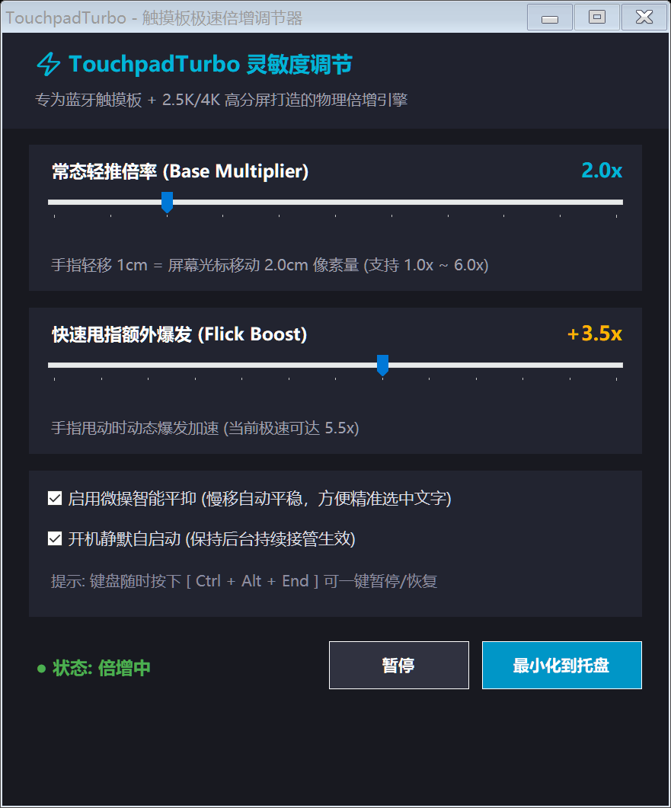

# ⚡ TouchpadTurbo (触摸板极速倍增调节器)

[](https://github.com/NoelJudeNoel/TouchpadTurbo/releases/latest)
[](https://microsoft.com)
[-green.svg)](https://dotnet.microsoft.com)
[]()
[](LICENSE)

专为 **Windows 蓝牙触摸板** 与 **2.5K / 4K 高分屏 / 多显示器** 打造的轻量级硬件级光标动力引擎。彻底解决第三方触摸板（如 Surface 键盘保护套）物理采样率（DPI）低、光标移动慢如泥潭、跨屏来回搓板累死人的核心痛点。

<p align="center">
  
</p>

<p align="center">
  <a href="https://github.com/NoelJudeNoel/TouchpadTurbo/releases/latest/download/TouchpadTurbo.exe">
    
  </a>
  &nbsp;&nbsp;
  <a href="https://github.com/NoelJudeNoel/TouchpadTurbo/releases/latest/download/TouchpadTurbo-v1.1.0-windows.zip">
    
  </a>
</p>

---

## 🌟 核心特性 (Features)

* 🚀 **1.0x ~ 6.0x 物理动力倍增**：实时拦截底层指针位移增量，将微小的手指推移放大为充沛的像素移动距离。
* 🛡️ **点击 / 拖拽原生保护 (Click & Drag Protection)**：
  * 按住鼠标任意按键时，**自动降为 100% 原生 1:1 无加速状态**。
  * 彻底解决 **Ditto 剪贴板历史** 点选时因微抖动超出拖拽阈值（4px）而导致点击变成拖拽、无法回填输入焦点的问题。
  * 完美稳定日常文字拖选、窗口移动与滑块微调，不再乱甩失控。
* 🛑 **快速划过防误点击 (Swipe Tap Filter)**：
  * 智能检测高速甩指滑动与手指离板动作。
  * 在快速滑行瞬间自动过滤偶发的触摸板硬件轻击判定，**彻底解决看视频时鼠标滑过误触发暂停、或切屏时意外失焦的烦恼**。
* ⚡ **快速甩指额外爆发（Flick Acceleration）**：独创三段式非线性贝塞尔爆发算法，随手轻轻一甩光标即可飞跃整块 2.5K 屏幕或跨双屏。
* 🎯 **微操智能平抑（Precision Hold）**：在极慢速微移时自动平抑降速，配合 1.2px 蓝牙底噪死区过滤，瞄准小按钮、框选单字稳如磐石。
* 🖥️ **高分屏暗色矢量 UI**：原生针对 Surface Pro 等高 DPI 缩放优化，自带触摸板系统 AAP（防误触）状态一键优化功能。
* 🎛️ **系统托盘与全局快捷键**：
  * 随时按下 **`Ctrl + Alt + End`** 瞬间切换开启/暂停，无缝对比手感。
  * 最小化静默常驻系统托盘，右键一键切换预设档位与保护开关。
* 🔒 **单实例互斥保护（Single-Instance Mutex）**：底层全局互斥锁，彻底杜绝开机或误点导致多开实例的问题。
* 🪶 **极致轻量，零第三方依赖**：
  * 单文件绿色运行（可执行文件仅 ~20KB）。
  * 内存占用仅 ~15MB，CPU 占用率日常 **0.00%**。
  * 纯原生 Win32 P/Invoke 驱动，利用 Windows 自带的 `csc.exe` 秒级编译完成。

---

## 🛠️ 技术原理 (Architecture)

### 为什么会出现焦点丢失与点击失效？
1. **Windows 拖拽阈值机制 (`SM_CXDRAG`)**：
   在 Windows 中，当鼠标按下并移动超过 4 像素时，系统会将该操作判定为「拖拽（Drag & Drop）」而非「点击（Click）」。高倍增环境下，手指按击的轻微自然微抖动会被放大数倍，直接击穿 4px 阈值，导致剪贴板工具（如 Ditto）将单击识别为拖拽项并取消自动回填。
2. **触摸板超敏与轻击判定 (`AAPThreshold`)**：
   当用户将触摸板灵敏度设为最高（AAP=0）时，系统驱动缺少防误触延迟。手指在触摸板上快速划过并在末端抬起时，很容易被固件与驱动误识别为一次 Tap（轻击）。当光标飞过视频播放器或背景窗口时，这次多余的轻击就会造成视频暂停或输入焦点被夺走。
3. **TouchpadTurbo v1.1 的解法**：
   * 在按键按下期间（以及释放后 80ms 防反弹窗口内）主动旁路加速倍率，维持 1:1 原生像素位移。
   * 内置滑动惯性速度追踪器，在快速滑动后毫秒级阻断非预期抬指轻击。

---

## 🚀 编译与运行 (Build & Run)

本项目无需安装 Visual Studio 或 .NET SDK，利用 Windows 10/11 系统自带的 .NET Framework 编译器即可秒级完成编译：

```cmd
# 运行仓库根目录的 build.bat 即可一键生成二进制文件：
build.bat
```

编译出的成品位于 `bin\TouchpadTurbo.exe`，双击即可直接使用。

---

## ⌨️ 快捷键说明 (Shortcuts)

| 快捷键 | 功能说明 |
| :--- | :--- |
| **`Ctrl + Alt + End`** | 一键暂停 / 恢复倍增加速 |
| **双击托盘图标** | 呼出 / 隐藏调节面板 |
| **右键托盘图标** | 快速切换常用倍速档位 (1.5x ~ 4.0x) 及防误触开关 |

---

## 📄 开源许可 (License)

本项目基于 [MIT 许可证](LICENSE) 开源。
